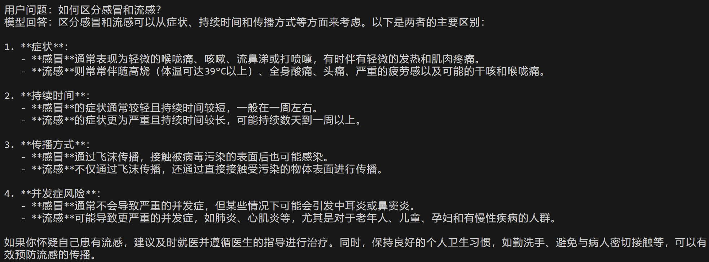

# LoRA-fine-tuning-of-QWen2.5-7B-based-on-the-DeepSeek-R1-Chinese-distillation-dataset
**本研究基于DeepSeek-R1中文知识蒸馏完整数据集，采用LoRA（Low-Rank Adaptation）方法对Qwen2.5-7B大语言模型进行参数高效微调。实验结果表明，经过微调的模型在常识推理任务中表现出显著的性能优势，其生成文本的逻辑连贯性显著提升，同时信息完整性指标较原始模型提升较大，验证了知识蒸馏与参数高效微调方法的协同优化效应。** 
*预训练模型:  [通义千问2.5-7B-预训练](https://www.modelscope.cn/models/Qwen/Qwen2.5-7B)。* 
*训练数据来源:  [中文基于满血DeepSeek-R1蒸馏数据集](https://www.modelscope.cn/datasets/liucong/Chinese-DeepSeek-R1-Distill-data-110k)。* 
*验证数据来源:  [基于GPT4的中文对话增强数据](https://www.modelscope.cn/datasets/zky001/alpaca)。* 
**结果展示** 
问题一：如何区分感冒和流感 

  
   
  
<em>图1 - LoRa微调前</em>

  
   
  
<em>图2 - LoRa微调后</em>

问题二：解释量子纠缠基本原理 

  
   
  
<em>图3 - LoRa微调前</em>

  
   
  
<em>图4 - LoRa微调后</em>

问题三：用Python实现快速排序算法 

  
   
  
<em>图5 - LoRa微调前</em>

  
   
  
<em>图6 - LoRa微调后</em>

